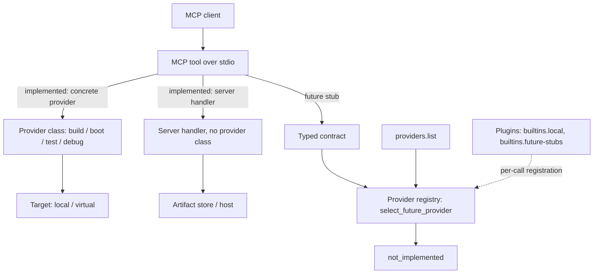

# Linux Development MCP Server

Linux Debug MCP is a Python MCP server for local Linux kernel build, boot,
smoke-test, artifact, and QEMU gdbstub debug workflows. It also ships
discovery-only stubs for future remote, reservation, provisioning, hardware,
console, and real-boot providers.

## Architecture

The server exposes atomic **MCP tools** over stdio. How a tool runs depends on
the tool:

- **Implemented local tools** dispatch in one of two ways, neither of which
  consults the provider registry:
  - *concrete-provider dispatch* — the tool's handler calls a provider class
    directly (`LocalKernelBuildProvider`, `LibvirtQemuProvider`,
    `LocalSshTestProvider`, `QemuGdbstubProvider`) to act on a local or virtual
    target.
  - *server-handler orchestration* — other tools run entirely in the server with
    no provider class. These split into two kinds: tools advertised as
    metadata-only operations of a provider capability (`host.check_prerequisites`
    under `local-prereqs`; `kernel.create_run` and `artifacts.get_manifest` under
    `local-artifacts`), and orphan server tools that back no provider operation at
    all (`providers.list`, `artifacts.collect`, `workflow.build_boot_test`).
- **Future-stub tools** validate a typed request contract, then resolve an
  advertised provider through the registry (`select_future_provider`). A
  contract-valid request that resolves to exactly one provider returns
  `not_implemented`; contract or provider-selection failures — unknown provider,
  an unadvertised operation or architecture, zero matches, or multiple matches —
  return `configuration_error`. These stubs never touch the network, hardware,
  or any external resource.

The **provider registry** is a discovery catalog, not a request hop for
implemented tools. It is materialized on demand from **provider plugins**
(`builtins.local`, `builtins.future-stubs`) whenever `providers.list` or a
future-stub tool needs it — there is no persistent registry built at startup.
The registry, the typed contracts, and registry-mediated selection are the
forward-looking machinery for the future provider surface; today they back
discovery and the stub tools while implemented tools dispatch directly. This is
the current proof-of-concept to functioning-design boundary.



## Providers

Each provider belongs to a *family* and declares an implementation state.
Discovery-only stubs are advertised for planning and contract validation; they
are not working features.

**Implemented** (all x86_64):

| Family | Provider | State | Arch | Representative operations | Target |
|--------|----------|-------|------|---------------------------|--------|
| host | local-prereqs | implemented | x86_64 | host.check_prerequisites | local / virtual |
| artifacts | local-artifacts | implemented | x86_64 | kernel.create_run, artifacts.get_manifest | local / virtual |
| build | local-kernel-build | implemented | x86_64 | kernel.build | local |
| boot | local-libvirt-qemu | implemented | x86_64 | target.boot | virtual |
| test | local-ssh-tests | implemented | x86_64 | target.run_tests | virtual |
| debug | local-qemu-gdbstub | implemented | x86_64 | workflow.build_boot_debug + 11 debug.* ops | virtual |

**Discovery-only stubs (not yet implemented):**

| Family | Provider | State | Arch | Representative operations | Target |
|--------|----------|-------|------|---------------------------|--------|
| build | remote-build-stub | stub | x86_64, ppc64le | remote.build_kernel | remote |
| artifacts | remote-artifact-sync-stub | stub | x86_64, ppc64le | remote.sync_artifacts | remote |
| reservation | reservation-stub | stub | x86_64, ppc64le | reservation.request_host, reservation.release_host | remote / physical |
| provisioning | provisioning-stub | stub | x86_64, ppc64le | provision.prepare_target | remote / physical |
| hardware | hardware-control-stub | stub | x86_64, ppc64le | hardware.power_control | physical |
| console | console-access-stub | stub | x86_64, ppc64le | console.open_session, console.read, console.write | remote / physical |
| boot | real-boot-stub | stub | x86_64, ppc64le | hardware.boot_kernel, workflow.reserve_provision_boot | remote / physical |

A stub request returns `not_implemented` only when it is contract-valid and
resolves to exactly one advertised provider; validation and provider-selection
failures return `configuration_error`. Stubs perform no external side effects.
A third state, `external_reserved`, exists for future externally-hosted
providers but is unused today.

**Orchestration / utility tools** — `providers.list`, `artifacts.collect`, and
`workflow.build_boot_test` — are implemented MCP tools the server registers
directly; they back no provider operation and appear in no provider's metadata.
By contrast, `host.check_prerequisites`, `kernel.create_run`, and
`artifacts.get_manifest` are also server-handled with no provider class, but they
*are* advertised as metadata-only operations of the `local-prereqs` and
`local-artifacts` providers — so they appear in the Implemented table above, while
the three orchestration tools belong to no provider row.

### Architecture support

x86_64 is the only architecture with working implemented providers. `ppc64le` is
recognized by the contract layer and advertised by the future-provider stubs,
but has no functioning implementation yet — see the
[ppc64le Provider Spike](docs/ppc64le-provider-spike.md) for design notes and
current boundaries.

## What Works Today

Local x86_64 build to boot to smoke-test to debug, end to end, plus artifact
manifests and discovery-only future-provider stubs. A full architecture document
is in progress; the sections above are the current orientation.

## Quick Start

```bash
git clone git@github.com:randomparity/linux-debug-mcp.git linux-debug-mcp
cd linux-debug-mcp
just setup
uv run python -m pytest
```

See [Installation](docs/installation.md) for direct `uv`, minimal `pip`, host
check, and server smoke-check commands.

## Connect A Client

The server runs over stdio. See [Client Setup](docs/client-setup.md) for Claude
Code and Codex configuration.

## Local Workflow

Use `providers.list` and `host.check_prerequisites` before selecting a workflow.
The implemented end-to-end local examples are documented in
[Tool Reference](docs/tool-reference.md). Host preparation for libvirt/QEMU is
documented in [Fedora Libvirt User Guide](docs/fedora-libvirt-user-guide.md).

## Development

```bash
just test
just lint
```
