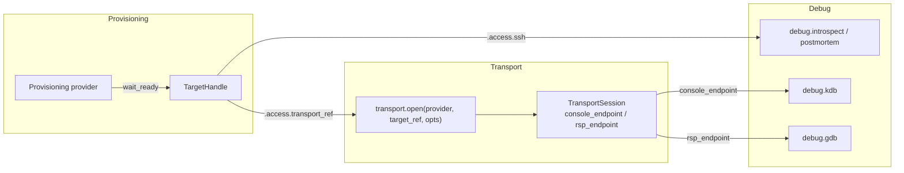
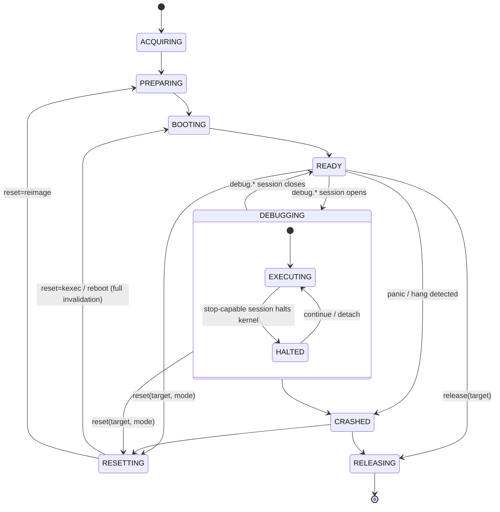

# Interface Contract: Provisioning ↔ Transport

**Type:** Living spec / reference document
**Repo location:** `docs/interface-contracts.md`
**Status:** Settled — all open questions resolved (§9); ready for provisioning sub-issues
**Owned jointly by:** Transport provider abstraction issue + Provisioning epic
**Related issues:** Transport abstraction (01), x86_64 transports (06), ppc64le
transports (07), Cross-cutting hardening (08), debug tiers (02/03/04/05),
Provisioning epic (TBD)

---

## 1. Purpose & scope

`linux-debug-mcp` has two independent provider registries that must compose:

- **Provisioning providers** — "give me a target booted on my kernel"
  (local/remote KVM, Proxmox, bare-metal x86_64, PowerVM LPAR, cross-arch QEMU).
- **Transport providers** — "here is how I reach a target's console / debugger"
  (`qemu-gdbstub`, `ipmi-sol`, `redfish-serial`, `ser2net`, `hmc-vterm`,
  `novalink`, `openbmc-sol`).

This document is the single source of truth for the seam between them. It exists
because the coupling is non-trivial: a target's console may be a scarce
single-owner resource, a reset can invalidate a live debug session mid-flight,
and break-injection + symbol resolution depend on facts only the provisioner
knows. Documenting it once prevents the same logic being reinvented (and drifting)
across the transport and provisioning issues.

**In scope:** the data schemas exchanged, the console-ownership protocol, the
target lifecycle and its invalidation events, and the platform metadata the debug
stack consumes.

**Out of scope:** the internal implementation of any single provider, and secret
*storage* (owned by issue 08 — this contract only carries secret *references*).

---

## 2. The composition seam

Provisioning never implements console/RSP access; it returns a **`TransportRef`**
that the transport registry consumes. The two registries meet at exactly one
call: provisioning's `wait_ready()` produces what `transport.open()` accepts.



Note the split: `debug.introspect` and `debug.postmortem` ride the
`TargetHandle.access.ssh` channel and need **no transport at all**;
`debug.kdb`/`debug.gdb` need a `TransportSession`.

---

## 3. Contract A — Target → Transport handoff

### 3.1 `TargetHandle` (produced by provisioning `wait_ready()`)

Consumed by the transport layer (01) and the debug tiers (02/03/04/05).

```yaml
TargetHandle:
  target_id:    str            # opaque, provisioner-scoped unique id
  provisioner:  str            # provider name that owns this target
  arch:         enum           # x86_64 | ppc64le | s390x | aarch64
  native:       bool           # false => emulated (e.g. s390x via QEMU TCG)
  state:        TargetState    # see §5
  access:
    ssh:           SshEndpoint | null   # host, port, user, key_ref (key_ref via Secrets)
    transport_ref: TransportRef | null  # the seam; null only for ssh-only targets
  platform:     PlatformMetadata        # §4.1
  kernel:       KernelProvenance        # §4.2
  lease:        LeaseInfo | null        # for pooled / scarce targets (bare-metal, LPAR)
```

### 3.2 `TransportRef` (the handoff tuple)

Expands into the `transport.open(provider, target_ref, opts)` call defined in
issue 01. **Secrets are references, never inline values** (issue 08).

```yaml
TransportRef:
  provider:      str           # qemu-gdbstub | ipmi-sol | redfish-serial |
                               # ser2net | hmc-vterm | novalink | openbmc-sol
  target_ref:    dict          # provider-specific connection params (NON-secret)
  opts:          dict          # non-secret options (timeouts, raw-mode assertions, etc.)
  secret_refs:   list[str]     # resolved via the Secrets interface (08); never inline
  required_caps: list[str]     # capabilities the chosen debug tier needs (§3.3)
```

### 3.3 Capability advertisement & validation

Transport providers advertise capability flags (defined in issue 01):
`provides_console`, `provides_rsp`, `supports_uart_break`. Provisioning providers
advertise `compatible_transports: list[str]`.

**Validation rule (enforced at registration/startup, not at debug time):** for
each provisioner, every entry in `compatible_transports` MUST resolve to a
registered transport, and the union of those transports' capabilities MUST cover
the capabilities the provisioner's supported debug tiers require:

| Debug tier          | Channel used                  | `required_caps`     |
| ------------------- | ----------------------------- | ------------------- |
| `debug.introspect`  | `TargetHandle.access.ssh`     | *(none — no transport)* |
| `debug.postmortem`  | `access.ssh` + artifacts      | *(none — no transport)* |
| `debug.kdb`         | `TransportSession.console`    | `provides_console`  |
| `debug.gdb`         | `TransportSession.rsp`        | `provides_rsp`      |

Validation MUST fail loud at startup. A provisioner that supports only an
ssh-only target (e.g. a hardened box exposing no console) advertises
`transport_ref = null` and is valid for the introspect/postmortem tiers only.

### 3.4 `LeaseInfo` (minimal shape for pooled / scarce targets)

Carried on `TargetHandle` for scarce targets (bare-metal lab nodes, LPAR pools,
metered cloud). The **scheduling / locking policy is out of scope** (resolved,
§9.2) — only the shape and the expiry rule live in this contract.

```yaml
LeaseInfo:
  lease_id:    str
  holder:      str
  expires_at:  timestamp | null   # null => non-expiring (local / owned target)
  renewable:   bool
```

Rule: **lease expiry routes through the `target.released` invalidation path**
(§5.4–5.5). A stop-capable debug session SHOULD check remaining lease time at
attach and refuse to start against a lease about to expire; expiry mid-session is
handled as a `CRASHED`-class invalidation. How leases are granted, queued,
renewed, and reclaimed belongs to the separate scheduling concern, not here.

---

## 4. Contract C — Platform metadata the debug stack consumes

### 4.1 `PlatformMetadata` (break-injection facts + console topology)

Provisioning supplies **facts**; issue 08 owns the **policy** that maps facts →
break method; issue 01 **executes** it. Provisioning MUST NOT hardcode a method.

```yaml
PlatformMetadata:
  console_kind:         enum   # uart | hvc | virtio | qemu_gdbstub
  console_count:        int    # 1 for PowerVM LPAR (hvc0) / single-serial metal
  dedicated_debug_line: bool   # true if a 2nd serial line is reserved for kgdb
  ssh_reachable:        bool   # whether in-guest sysrq-g over ssh is available
  break_hints:          list[enum]   # provider-suggested, non-authoritative:
                               #   uart_break | sysrq_g | agent_proxy_break | gdbstub_native
```

The three-way flow (documented here, implemented across three issues):

```
provisioning (facts) ──► break-injection policy (08, decides) ──► transport.inject_break (01, executes)
```

Reference mappings the policy (08) is expected to encode:

- `qemu_gdbstub` → `gdbstub_native` (no break needed; gdb interrupts directly).
- `uart` + `dedicated_debug_line=true` → `uart_break` via agent-proxy.
- `hvc` (PowerVM LPAR) → `sysrq_g` over ssh (hvterm BREAK semantics differ from UART).
- single-console + `ssh_reachable=false` → `agent_proxy_break` on the shared line.

### 4.2 `KernelProvenance` (for symbol version-locking)

Only the provisioner knows exactly what it staged and booted. The version-lock
check (08) and every symbol-consuming tier (02/04/05) depend on this.

```yaml
KernelProvenance:
  build_id:     str            # ELF build-id of the booted vmlinux (authoritative key)
  release:      str            # uname -r / vermagic
  vmlinux_ref:  str            # where to fetch the matching vmlinux + DWARF
  modules_ref:  str | null     # matching module debuginfo bundle
  cmdline:      str            # kernel command line actually booted
  config_ref:   str | null     # the .config used (provenance / repro)
```

Consumers MUST verify `build_id` against the live/crashed kernel before loading
symbols and MUST fail loud on mismatch rather than emitting garbage.

---

## 5. Contract B — Console ownership & session lifecycle

### 5.1 Target lifecycle



### 5.2 Console as a single-owner lease

A target's console is a **single-owner lease**. This is load-bearing on
single-console targets — a **PowerVM LPAR has one vterm per partition**, and
single-serial bare metal has one line; provisioning and the debug transport
cannot hold it simultaneously.

```yaml
ConsoleLease:
  owner:  enum   # provisioner | transport | free
  target: target_id
```

- **`qemu-gdbstub` exception:** RSP is a separate TCP channel, so console
  contention does not arise; the lease is trivially `free` and this protocol is a
  no-op. The lease matters only for serial/console-multiplexed transports
  (`ipmi-sol`, `ser2net`, `hmc-vterm`, `openbmc-sol`, `novalink` console).

### 5.3 Boot → debug handoff protocol

1. `ACQUIRING`–`BOOTING`: provisioner holds the lease (`owner=provisioner`) — it
   needs the console for SMS/petitboot/PXE selection and boot-banner detection.
2. On entering `READY`: provisioner **releases** the console
   (`rmvterm` for HMC; deactivate SOL; disconnect ser2net) and sets `owner=free`.
   This release is a required step of `wait_ready()`, not optional cleanup.
3. `transport.open()` acquires the lease (`owner=transport`) and the target moves
   to `DEBUGGING` when a `debug.*` session attaches.

### 5.4 Reset / kexec invalidation

Any transition **out of `READY`/`DEBUGGING`** (`RESETTING`, `CRASHED`,
re-entering `BOOTING`, `RELEASING`) MUST:

1. Emit a target lifecycle event (see §5.5).
2. Invalidate every `TransportSession` bound to that `target_id` — the
   `rsp_endpoint` is gone, agent-proxy is now talking to a dead line, and the
   console stream desyncs.
3. Return the console lease to `free` (or to `provisioner` if a re-boot needs it),
   so provisioning can drive boot selection again.

Transport sessions are **bound to a `target_id`** and subscribe to its lifecycle
events; they MUST treat invalidation as terminal and re-establish from scratch
(restart agent-proxy, re-acquire lease) rather than attempting to reuse state.

**kexec (resolved, §9.3):** a kexec boot is modeled as the normal
`RESETTING → BOOTING → READY` path via `reset(mode=kexec)` and is **full
invalidation**. Transport-survival ≠ session-survival — even where the byte pipe
physically survives (gdbstub TCP always; agent-proxy on a persistent line
sometimes), the debug session never does (different kernel, addresses, symbols,
stale breakpoints). There is **no transport re-sync optimization**: transport
re-establishment is sub-second and dwarfed by the kexec boot itself, so it is not
worth the complexity.

### 5.5 Lifecycle events (provisioning emits, transport subscribes)

```
target.booting    -> invalidate bound transport sessions
target.ready      -> console lease released to free; transports may open
target.resetting  -> invalidate bound transport sessions; reclaim lease
target.crashed    -> invalidate bound transport sessions (postmortem may follow)
target.released   -> invalidate everything; reap helpers
```

**Delivery (resolved, §9.1):** events are dispatched by a small **in-process
dispatcher keyed by `target_id`**, behind a thin interface — not a message broker.
All provider code is co-located in the single MCP server process; only the
*targets* are remote, so this is an intra-process concern. Invalidation-class
events (`target.booting`, `target.resetting`, `target.crashed`,
`target.released`) are delivered **synchronously / awaited**: the state transition
does not complete until every bound subscriber has torn down. Fire-and-forget
would let a reset race an in-flight RSP read, breaking the §5.4 invariant. The
interface keeps the decision reversible — the backend can be swapped for a real
bus if provisioning is ever split into its own process.

### 5.6 Execution-state gate (concurrent access)

`DEBUGGING` has two sub-states (§5.1): the kernel is either `EXECUTING` or
`HALTED` (parked in the debugger with all CPUs stopped). Concurrency is gated on
**execution state, not session type** — because while `HALTED` the network stack
is frozen and the ssh channel is physically dead, so an ssh-tier call would *hang*
rather than fail. Three rules (resolved, §9.4):

1. **One stop-capable session per target.** At most one `debug.gdb` **xor**
   `debug.kdb` session may be attached. On serial/single-console targets the
   console lease (§5.2) enforces this; for `qemu-gdbstub` enforce it explicitly.
2. **ssh-tier ops are gated on `EXECUTING`.** While `HALTED`, `debug.introspect`
   (live) and smoke tests are **rejected immediately** with a clear error
   ("target halted in debugger; resume or detach first") — never left to hang.
   While the stop-capable session has **continued** the kernel (`EXECUTING`), they
   are **permitted**; drgn-live reads are racy-by-design and that is acceptable and
   inherent to live introspection.
3. **vmcore analysis is always concurrent-safe.** `debug.postmortem` against a
   captured vmcore has no live dependency and is never gated.

---

## 6. Ownership map

| Concern                                   | Owner (issue)                | Consumers                              |
| ----------------------------------------- | ---------------------------- | -------------------------------------- |
| `TransportRef` schema + `transport.open`  | Transport abstraction (01)   | All provisioning providers             |
| Transport capability flags + validation   | Transport abstraction (01)   | Provisioning registration              |
| `TargetHandle` / `TargetState` schema     | Provisioning epic            | Transport (01), debug tiers (02/04/05) |
| Target lifecycle + events (§5.5)           | Provisioning epic            | Bound transport sessions (01)          |
| Console lease + handoff protocol (§5.2–4)  | **This contract** (01 + prov)| `hmc-vterm` (07), `ipmi-sol`/`ser2net` (06) |
| `PlatformMetadata` (break-injection facts) | Provisioning providers       | Break policy (08) → transport exec (01)|
| Break-injection policy (facts → method)    | Hardening (08)               | Transport (01), `debug.kdb/gdb` (03/04)|
| `KernelProvenance` + version-lock          | Provisioning (prepare/boot)  | Version-lock (08), debug tiers (02/04/05) |
| Secret resolution (`secret_refs`)          | Hardening (08)               | All transports (06/07)                 |
| Lifecycle event dispatcher (awaited)       | Provisioning epic            | Bound transport sessions (01), SessionGuard (08) |
| Target execution-state gate (§5.6)         | **This contract** (01 + debug tiers) | `debug.introspect/kdb/gdb/postmortem` (02–05) |
| `LeaseInfo` shape + expiry rule (§3.4)     | **This contract**            | Transport (01), debug tiers; scheduling concern (future) |

---

## 7. Intra-transport coordination edges

Most are captured by existing "Depends on" edges (06/07 depend on 01; 06/07/01
consume 08's Secrets + SessionGuard). Two are stronger than the abstraction edge
and must be stated explicitly:

- **`openbmc-sol` (07) reuses the `ipmi-sol` implementation (06)** — not just the
  abstraction. 07 has a code dependency on 06, so order 06 before 07.
- **Break-injection is split: 01 executes, 08 owns the policy** — the same
  cross-cutting concern as §4.1. Both 01 and 08 reference this contract for it.

---

## 8. Validation & test requirements (contract conformance)

These belong in the test suites of the respective issues but are enumerated here
so the contract is enforced, not just described:

- [ ] Startup capability validation rejects a provisioner whose
      `compatible_transports` are missing or under-capable (§3.3).
- [ ] A provisioning `reset()` while a `debug.gdb` session is open invalidates that
      session (no stale RSP reuse) and returns the console lease (§5.4).
- [ ] On a single-console target (mock HMC vterm), the provisioner releases the
      lease at `READY` before any transport can `open()` (§5.3).
- [ ] `build_id` mismatch between `KernelProvenance` and the live/crashed kernel
      causes the debug tier to fail loud (§4.2).
- [ ] No `secret_refs` value is ever resolved to an inline secret in any
      `TransportRef`, log line, or tool output (§3.2, issue 08).
- [ ] `qemu-gdbstub` path treats the console lease as a no-op (§5.2).
- [ ] Invalidation-class lifecycle events are awaited: a `reset()` does not
      complete until bound transport sessions have torn down (§5.5, §9.1).
- [ ] Lease expiry triggers the `target.released` invalidation path (§3.4, §9.2).
- [ ] An ssh-tier op (`debug.introspect` live / smoke test) issued while the target
      is `HALTED` is rejected immediately, not hung (§5.6, §9.4).
- [ ] An ssh-tier op is permitted while a stop-capable session has the kernel
      `EXECUTING` (continued) (§5.6, §9.4).
- [ ] A second stop-capable session (`debug.gdb`/`debug.kdb`) against a target that
      already has one is refused (§5.6, §9.4).
- [ ] A kexec reset (`reset(mode=kexec)`) fully invalidates the prior debug session;
      no transport re-sync is attempted (§5.4, §9.3).

---

## 9. Resolved decisions

The four design questions below are **settled** and recorded here so that
implementation from the GitHub issues does not re-open them.

1. **Event transport → in-process dispatcher, awaited for invalidation.** All
   provider code runs in the single MCP server process (only targets are remote),
   so lifecycle events are an intra-process concern. Use a small dispatcher keyed
   by `target_id` behind a thin interface; deliver invalidation-class events
   synchronously / awaited so transitions block until subscribers tear down
   (§5.5). Reversible — the backend can be swapped for a real bus without touching
   call sites if provisioning is ever split into its own process.

2. **Pooled-target leasing → policy separate; contract carries only shape +
   expiry rule.** Scheduling, queuing, locking, renewal, and pool inventory live
   in a separate (future) concern and are provider-specific — not all provisioners
   need scarcity handling (local KVM, Proxmox-with-capacity don't). The contract
   owns only the minimal `LeaseInfo` shape (§3.4) and the rule that lease expiry
   routes through the `target.released` invalidation path (§5.4–5.5).

3. **kexec → full invalidation, always; no re-sync.** Transport-survival ≠
   session-survival: the byte pipe may survive a kexec, but the debug session
   never does (different kernel, addresses, symbols, stale breakpoints). Transport
   re-establishment is not the bottleneck (the kexec boot itself dominates), so a
   re-sync optimization is rejected. kexec is modeled as the normal
   `RESETTING → BOOTING → READY` path via `reset(mode=kexec)` (§5.1, §5.4).

4. **Concurrent reads → execution-state gate, permissive while continued.** Gate
   on target execution state (`EXECUTING` vs `HALTED`), not session type: one
   stop-capable session per target; ssh-tier ops fast-rejected while `HALTED` and
   permitted while `EXECUTING`; vmcore analysis always concurrent-safe (§5.6). The
   permissive choice is deliberate — drgn-live concurrent with a *running* kernel
   is exactly what drgn is designed for, and the racy read is inherent, not a bug.

---

## 10. References

- Transport abstraction & `transport.open` / capability flags — issue 01
- Break-injection policy & `KernelProvenance` version-locking — issue 08
- Single-vterm constraint (PowerVM LPAR `hvc0`) — issue 07
- SOL fragility / raw-TCP requirements — issue 06
- agent-proxy / kdmx — `git.kernel.org/pub/scm/utils/kernel/kgdb/agent-proxy.git`

