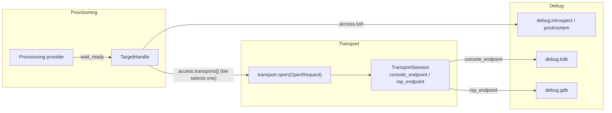
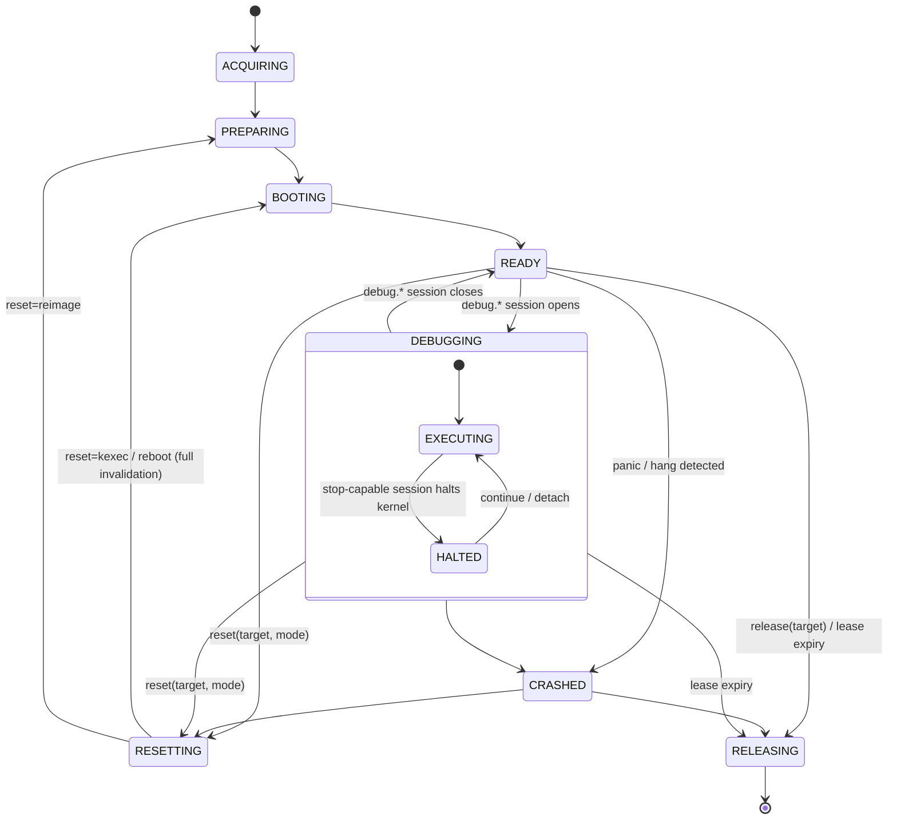

# Interface Contract: Provisioning ↔ Transport

**Type:** Living spec / reference document
**Repo location:** `docs/specs/interface-contracts.md`
**Status:** Settled — all open questions resolved (§9); ready for provisioning sub-issues
**Owned jointly by:** Transport provider abstraction issue + Provisioning epic
**Related issues:** Transport abstraction (01), x86_64 transports (06), ppc64le
transports (07), Cross-cutting hardening (08), debug tiers (02/03/04/05),
Provisioning epic (TBD)

---

## 1. Purpose & scope

`linux-debug-mcp` has two independent provider registries that must compose:

- **Provisioning providers** — "give me a target booted on my kernel"
  (local/remote KVM, Proxmox, bare-metal x86_64, PowerVM LPAR, cross-arch QEMU).
- **Transport providers** — "here is how I reach a target's console / debugger"
  (`qemu-gdbstub`, `qemu-virtio-serial`, `ipmi-sol`, `redfish-serial`, `ser2net`,
  `hmc-vterm`, `novalink`, `openbmc-sol`).

This document is the single source of truth for the seam between them. It exists
because the coupling is non-trivial: a target's console may be a scarce
single-owner resource, a reset can invalidate a live debug session mid-flight,
and break-injection + symbol resolution depend on facts only the provisioner
knows. Documenting it once prevents the same logic being reinvented (and drifting)
across the transport and provisioning issues.

**In scope:** the data schemas exchanged, the console-ownership protocol, the
target lifecycle and its invalidation events, and the platform metadata the debug
stack consumes.

**Out of scope:** the internal implementation of any single provider, and secret
*storage* (owned by issue 08 — this contract only carries secret *references*).

---

## 2. The composition seam

Provisioning never implements console/RSP access; it returns a **`TransportRef`**
that the transport registry consumes. The two registries meet at exactly one
call: provisioning's `wait_ready()` produces what `transport.open()` accepts.



Note the split: `debug.introspect` and `debug.postmortem` ride the
`TargetHandle.access.ssh` channel and need **no transport at all**;
`debug.kdb`/`debug.gdb` need a `TransportSession`.

---

## 3. Contract A — Target → Transport handoff

### 3.1 `TargetHandle` (produced by provisioning `wait_ready()`)

Consumed by the transport layer (01) and the debug tiers (02/03/04/05).

```yaml
TargetHandle:
  target_id:    str            # opaque, unique within `provisioner` (see TargetKey)
  provisioner:  str            # provider name that owns this target
  generation:   int            # freshness fence; bumped on every reset/kexec/reimage/
                               #   release/lease_expired — see "Handle freshness" below
  arch:         enum           # x86_64 | ppc64le | s390x | aarch64
  native:       bool           # false => emulated (e.g. s390x via QEMU TCG)
  state:        TargetState    # see §5
  access:
    ssh:           SshEndpoint | null   # host, port, user, key_ref (key_ref via Secrets)
    transports:    list[TransportRef]   # the seam; one entry per offered channel; [] for ssh-only
  platform:     PlatformMetadata        # §4.1
  kernel:       KernelProvenance        # §4.2
  lease:        LeaseInfo | null        # for pooled / scarce targets (bare-metal, LPAR)
```

**Global identity (`TargetKey`).** `target_id` is unique only within its issuing
`provisioner`; two provisioners may legally mint the same `target_id`. The
contract-wide identity is therefore the tuple **`TargetKey = (provisioner,
target_id)`**. Every console lease, lifecycle subscription, lifecycle event, and
`TransportSession` binding MUST key on the full `TargetKey`, never on `target_id`
alone — keying on `target_id` alone would let one target's reset/release event
invalidate (or fail to invalidate) another target's sessions.

**Handle freshness (`generation`).** `TargetKey` is stable across a target's whole
life — the lease manager, `StopCapableGuard`, and dispatcher key on it across
reboots. It is therefore **not** a freshness signal: after a reset/kexec/reimage,
a release, or a `lease_expired` tears down bound operations and the *same*
`TargetKey` returns to `READY`, a handle minted in the previous incarnation is
stale (its `transport_ref` endpoints, `platform` facts, `kernel` provenance, and
`lease` may all have changed). `generation` is the per-`TargetKey` monotonic fence
that distinguishes incarnations: provisioning **bumps** it on every transition
listed above (§5.4–5.5), and admission rejects any `OpenRequest` whose
`generation` is not current (`stale_handle`, §5.3) before acquiring anything. On
scarce targets the current `lease.lease_id` is compared the same way, so a handle
from a prior lease holder cannot be replayed.

### 3.2 `TransportRef` (one offered channel)

`TargetHandle.access.transports` carries **one `TransportRef` per channel the
target actually exposes** — e.g. a box with both a serial console and a
qemu-gdbstub offers two entries (one `provides_console`, one `provides_rsp`); an
ssh-only target offers `[]`. Each entry is a candidate channel the debug tier may
select and hand to `transport.open()` (issue 01). **Secrets are references, never
inline values** (issue 08).

```yaml
TransportRef:
  provider:      str           # qemu-gdbstub | qemu-virtio-serial | ipmi-sol |
                               # redfish-serial | ser2net | hmc-vterm | novalink |
                               # openbmc-sol
  channel_id:    str           # stable per-channel id, UNIQUE within transports[]
  line_role:     enum          # shared_console | dedicated_debug | rsp — see §4.1
  caps:          list[str]     # THIS channel's capabilities (provides_console /
                               # provides_rsp / supports_uart_break) — see §3.3
  target_ref:    dict          # provider-specific connection params (NON-secret)
  opts:          dict          # non-secret options (timeouts, raw-mode assertions, etc.)
  secret_refs:   list[str]     # resolved via the Secrets interface (08); never inline
```

Capabilities are a property of the **channel**, not only the provider, because one
provider can expose several distinct channels (e.g. `ser2net` fronting both a boot
console and a dedicated kgdb serial line). Each `TransportRef` therefore declares
its own `caps`, a `channel_id` unique within the target's `transports[]`, and a
`line_role` that classifies the physical line — `shared_console` (the boot/console
line, multiplexed with provisioning), `dedicated_debug` (a line reserved for
kgdb/kdb), or `rsp` (a gdbstub RSP channel). `line_role` is what the break-plan
predicates (§4.1) key on, so break injection lands on the right line even when a
target offers several break-capable serial channels. Provider name alone is **not**
a key — `(provider, channel_id)` is.

`transport.open()` does **not** receive a bare `TransportRef`: the parts the
contract later keys on — `TargetKey` for admission/binding/events (§3.1, §5.3),
`PlatformMetadata` for break-plan admission (§4.1), and the tier's `required_caps`
(§3.3) — are not derivable from a `TransportRef`. They are assembled by the debug
tier into a first-class `OpenRequest`:

```yaml
OpenRequest:                   # the actual argument to transport.open()
  target_key:    TargetKey     # canonical identity — admission/binding/events key on THIS
  generation:    int           # echoed from TargetHandle; admission rejects if stale (§3.1, §5.3)
  transport_ref: TransportRef  # the channel the tier selected (§3.3)
  required_caps: list[str]     # the tier's caps, for Layer-2 re-validation (§3.3)
  platform:      PlatformMetadata   # for break-plan admission on stop-capable tiers (§4.1)
  lease:         LeaseInfo | null   # the target's lease, for the near-expiry check (§3.4)
  min_lease_ttl: duration | null    # required lease headroom; null => contract default (§3.4)
```

`required_caps` is **not** a property of an offered channel — it is a property of
the *debug tier* doing the attach (§3.3 table), so it lives on the `OpenRequest`,
never baked into the handle by `wait_ready()` (which runs before any tier is
chosen). Likewise, provider-specific `transport_ref.target_ref` is connection
params only — it is **never** the authoritative identity; admission, session
binding, and lifecycle subscription key on `OpenRequest.target_key`. The
`transport_ref`, `platform`, and `lease` an `OpenRequest` carries are a snapshot
the tier read from the `TargetHandle`; admission re-binds them to the current
authoritative snapshot and rejects any that have drifted (§5.3), so a caller can
never attach using stale or foreign channel/lease facts even within a live
`generation`.

### 3.3 Capability advertisement & validation

Transport providers advertise capability flags (defined in issue 01):
`provides_console`, `provides_rsp`, `supports_uart_break`. Each offered channel
restates the subset it provides in its own `TransportRef.caps` (§3.2), since one
provider may front channels with different capabilities. Provisioning providers
advertise `compatible_transports: list[str]`.

**Validation is two-layer.** Layer 1 is an early structural check; Layer 2 is the
binding check that actually guarantees a usable channel.

**Layer 1 — startup (necessary, not sufficient):** for each provisioner, every
entry in `compatible_transports` MUST resolve to a registered transport, and the
union of those transports' capabilities MUST cover the capabilities the
provisioner's supported debug tiers require:

| Debug tier          | Channel used                  | `required_caps`     |
| ------------------- | ----------------------------- | ------------------- |
| `debug.introspect`  | `TargetHandle.access.ssh`     | *(none — no transport)* |
| `debug.postmortem`  | `access.ssh` + artifacts      | *(none — no transport)* |
| `debug.kdb`         | `TransportSession.console`    | `provides_console`  |
| `debug.gdb`         | `TransportSession.rsp`        | `provides_rsp`      |

**Transport selection.** The debug tier computes its `required_caps` from the
table above, then selects from `TargetHandle.access.transports` the **first entry
in `transports[]` array order that is *admissible* for the tier** — meaning its
`TransportRef.caps` ⊇ `required_caps` **and**, for the stop-capable tiers
(`debug.kdb`/`debug.gdb`), the entry also yields an executable break plan (§4.1)
for the target's `platform`. Selection is break-plan-aware on purpose: `kdb`'s
`required_caps` is only `provides_console`, so a caps-only rule would pick a boot
console with no `supports_uart_break` and fail open even when a later dedicated
debug line *can* break — the tier MUST skip the unbreakable channel and take the
first one that can actually stop the kernel. Matching is on the *channel's* `caps`
(plus break-plan), not the provider name — this is what disambiguates two channels
fronted by the same provider (e.g. a `ser2net` boot console vs. a `ser2net`
dedicated kgdb serial, where only the latter carries `supports_uart_break`).
`transports[]` order is authoritative and is the provisioner's stated preference;
`channel_id` ties an entry to a stable identity but is not itself an ordering key.
Selection is therefore total and deterministic even when provider names repeat,
and `transport.open()`'s Layer-2 + break-plan checks (§3.3, §4.1) then re-validate
the chosen channel rather than discovering it is unusable. The tier then assembles an `OpenRequest`
(§3.2) — `target_key`, the selected `TransportRef`, the computed `required_caps`,
`platform`, and any `lease` — and calls `transport.open(OpenRequest)`.

**Layer 2 — `transport.open()` / attach (authoritative):** the union check at
startup can pass while the *selected* channel's `TransportRef.caps` do not cover
the requested tier's `required_caps` (e.g. the target offers one channel with
`provides_rsp` and another with only `provides_console`, and the tier selected the
wrong one, or a single offered channel under-covers). The selected channel's
`caps` MUST therefore be re-validated against the tier's `required_caps` at
`open()`, and the live provider MUST actually back them; a shortfall is a hard
`open()` failure — no partial attach, no silent fallback. For stop-capable tiers (`debug.kdb`/`debug.gdb`),
`open()` additionally requires an **executable break plan** (§4.1): channel
capability alone does not guarantee the kernel can actually be stopped.

Validation MUST fail loud — at startup for Layer 1, at `open()` for Layer 2. A
provisioner that supports only an ssh-only target (e.g. a hardened box exposing no
console) offers `transports: []` and is valid for the introspect/postmortem tiers
only.

### 3.4 `LeaseInfo` (minimal shape for pooled / scarce targets)

Carried on `TargetHandle` for scarce targets (bare-metal lab nodes, LPAR pools,
metered cloud). The **scheduling / locking policy is out of scope** (resolved,
§9.2) — only the shape and the expiry rule live in this contract.

```yaml
LeaseInfo:
  lease_id:    str
  holder:      str
  expires_at:  timestamp | null   # null => non-expiring (local / owned target)
  renewable:   bool
```

Rule: **lease expiry is an involuntary invalidation that emits
`target.lease_expired` and routes to `RELEASING`** (§5.4–5.5). It is *not* modeled
as a crash — there is no panic and no implicit vmcore — but, like every
invalidation-class event, it tears down all bound sessions (§5.4) before the
target is reclaimed. Any vmcore captured *before* expiry remains referenceable
under the run's artifacts.

**Near-expiry admission (normative).** `OpenRequest` carries a `min_lease_ttl`
(the op's required headroom; absent ⇒ a contract default both ends agree on). At
attach the admission service (§5.3) MUST **reject** a stop-capable open when the
**current snapshot's** `expires_at` (not the caller-supplied copy — §5.3) is
non-null and within `min_lease_ttl` of now — so a debugger cannot
halt a scarce target moments before involuntary `lease_expired` reclamation. This
is a hard check, not a SHOULD. **Renewal is out of `transport.open()`'s scope:**
it belongs to the scheduling concern and MUST be completed *before* `open()` is
called; admission only inspects `expires_at`, it never renews. How leases are
granted, queued, renewed, and reclaimed otherwise belongs to that separate
scheduling concern, not here.

---

## 4. Contract C — Platform metadata the debug stack consumes

### 4.1 `PlatformMetadata` (break-injection facts + console topology)

Provisioning supplies **facts**; issue 08 owns the **policy** that maps facts →
break method; issue 01 **executes** it. Provisioning MUST NOT hardcode a method.
The policy's mapping design — topology-first predicates, preference ordering, the
`no_break_plan`/`break_disproved` taxonomy and disproof scope, and why `break_hints`
is non-authoritative — is recorded in
[ADR 0018](../adr/0018-break-injection-policy-mapping.md).

```yaml
PlatformMetadata:
  console_kind:         enum   # console topology ONLY: uart | hvc | virtio
  console_count:        int    # 1 for PowerVM LPAR (hvc0) / single-serial metal
  dedicated_debug_line: bool   # summary fact: true IFF some transports[] entry has
                               #   line_role=dedicated_debug (per-channel role is
                               #   authoritative — §3.2)
  ssh_reachable:        bool   # whether in-guest sysrq-g over ssh is available
  break_hints:          list[enum]   # provider-suggested, non-authoritative:
                               #   uart_break | sysrq_g | agent_proxy_break | gdbstub_native
```

`console_kind` describes the **console** only and is independent of whether an RSP
debug channel also exists: RSP presence is signalled by a `transports[]` entry
whose provider `provides_rsp` (§3.2), not by `console_kind`. A target may have
`console_kind=uart` *and* offer a qemu-gdbstub RSP channel; both facts coexist
without contradiction. (There is therefore no `qemu_gdbstub` value of
`console_kind` — a pure-gdbstub target simply has no serial console and one
`provides_rsp` transport.)

The three-way flow (documented here, implemented across three issues):

```
provisioning (facts) ──► break-injection policy (08, decides) ──► transport.inject_break (01, executes)
```

Each break method is executable only when its prerequisites hold. These
predicates are normative and are evaluated against the **selected channel's**
`line_role` + `caps` (§3.2) plus `platform` facts — never against a target-wide
guess about which line is which — so they make the reference mappings below
unambiguous even when a target offers several break-capable serial channels:

| Break method        | Requires (ALL of)                                              |
| ------------------- | -------------------------------------------------------------- |
| `gdbstub_native`    | selected channel `line_role=rsp` and `provides_rsp`            |
| `uart_break`        | selected channel `line_role=dedicated_debug` and `supports_uart_break` |
| `agent_proxy_break` | selected channel `line_role=shared_console` and `supports_uart_break` |
| `sysrq_g`           | `ssh_reachable=true` (sysrq-g issued in-guest over ssh; no line) |

Reference mappings the policy (08) is expected to encode (each assumes its
method's predicate above holds):

- channel `line_role=rsp` → `gdbstub_native` (no break needed; gdb interrupts
  directly), regardless of `console_kind`.
- channel `line_role=dedicated_debug` + `supports_uart_break` → `uart_break` via
  agent-proxy on that reserved line.
- `console_kind=hvc` (PowerVM LPAR) → `sysrq_g` over ssh (hvterm BREAK semantics
  differ from UART).
- single shared console + `ssh_reachable=false` + `supports_uart_break` →
  `agent_proxy_break` on that `shared_console` line.

**Break-method admission (stop-capable tiers).** Channel capability
(`provides_console`/`provides_rsp`) is necessary but **not sufficient** for
`debug.kdb`/`debug.gdb`: the session also needs an *executable* break method. At
`open()`/attach the policy (08) MUST compute a **break plan** by evaluating the
predicates above against `OpenRequest.platform` and the selected channel's
`line_role` + `caps`, and `open()` MUST fail loud **before creating the session**
if no method's predicate holds. The single shared-console/`ssh_reachable=false`
case is exactly the boundary: *with* `supports_uart_break` it is
`agent_proxy_break` (admissible); *without* it, no predicate holds —
`gdbstub_native` (no `rsp` line), `uart_break` (no `dedicated_debug` line),
`sysrq_g` (no ssh) all fail — so the attach MUST be rejected, not bound to a
session that can never halt.

### 4.2 `KernelProvenance` (for symbol version-locking)

Only the provisioner knows exactly what it staged and booted. The version-lock
check (08) and every symbol-consuming tier (02/04/05) depend on this.

```yaml
KernelProvenance:
  build_id:     str            # ELF build-id of the booted vmlinux (authoritative key)
  release:      str            # uname -r / vermagic
  vmlinux_ref:  str            # where to fetch the matching vmlinux + DWARF
  modules_ref:  str | null     # matching module debuginfo bundle
  cmdline:      str            # kernel command line actually booted
  config_ref:   str | null     # the .config used (provenance / repro)
```

Consumers MUST verify `build_id` against the live/crashed kernel before loading
symbols and MUST fail loud on mismatch rather than emitting garbage.

---

## 5. Contract B — Console ownership & session lifecycle

### 5.1 Target lifecycle



### 5.2 Console as a single-owner lease

A target's console is a **single-owner lease**. This is load-bearing on
single-console targets — a **PowerVM LPAR has one vterm per partition**, and
single-serial bare metal has one line; provisioning and the debug transport
cannot hold it simultaneously.

```yaml
ConsoleLease:
  target:      TargetKey     # (provisioner, target_id) — never target_id alone
  owner:       enum          # provisioner | transport | free
  token:       str | null    # opaque fence; null iff owner=free
  generation:  int           # incremented on every acquire / revoke
```

The lease is held by a single in-process lease manager and is mutated only
through three atomic operations — no caller writes `owner`/`token` directly:

- **`acquire(target, who) -> token`** — atomic compare-and-swap that succeeds
  only if `owner == free`. It sets `owner=who`, mints a fresh `token`, and
  increments `generation`. Concurrent `acquire` calls race on the CAS; the loser
  gets a `lease_conflict` error rather than a second grant, so two debug opens
  can never both observe `free` and proceed.
- **`release(target, token)`** — idempotent release-by-token. It returns the
  lease to `free` only if `token` matches the current generation's token; a stale
  token (held by a helper already invalidated under §5.4) is rejected as a no-op,
  so a dead helper cannot release a lease a newer owner now holds.
- **`revoke(target)`** — used only by the §5.4 invalidation path: forcibly sets
  `owner=free`, bumps `generation`, and invalidates the outstanding `token`. Any
  later `release` carrying the old token is the no-op above.

Every console operation carries its `token`; an operation whose token does not
match the current `generation` is refused. This fences a reset that returns the
lease (§5.4) against an old helper that still believes it owns the line.

- **`qemu-gdbstub` exception:** RSP is a separate TCP channel, so console
  contention does not arise; the lease is trivially `free` and this protocol is a
  no-op. The lease matters only for serial/console-multiplexed transports
  (`qemu-virtio-serial`, `ipmi-sol`, `ser2net`, `hmc-vterm`, `openbmc-sol`,
  `novalink` console) — `qemu-virtio-serial` carries the console over a
  virtio-serial/unix socket, so unlike `qemu-gdbstub` it is a single-owner line.

### 5.3 Boot → debug handoff protocol

1. `ACQUIRING`–`BOOTING`: provisioner holds the lease (`acquire(target,
   provisioner)`) — it needs the console for SMS/petitboot/PXE selection and
   boot-banner detection.
2. On entering `READY`: provisioner **releases** the console
   (`release(target, token)`; `rmvterm` for HMC; deactivate SOL; disconnect
   ser2net), returning `owner=free`. This release is a required step of
   `wait_ready()`, not optional cleanup.
3. `transport.open()` calls `acquire(target, transport)`; on success the target
   moves to `DEBUGGING` when a `debug.*` session attaches. A failed `acquire`
   (`lease_conflict`) means another owner holds the line, so `open()` fails
   rather than attaching to a contended console.

**Admission is a `TargetKey`-scoped service shared by *all* live operations.**
Both `transport.open()` *and* the SSH-backed live tiers (`debug.introspect` live,
smoke tests) enter through one per-`TargetKey` admission service before they touch
the target — SSH tiers need no `TransportSession`, but they still race resets and
HALTED transitions, so they cannot be exempt. Only offline `debug.postmortem`
against a captured vmcore (no live dependency, §5.6 rule 3) bypasses admission.
`admit(target_key, op)` atomically:

1. **freshness + snapshot binding:** rejects `stale_handle` unless the supplied
   `generation` equals the `TargetKey`'s current generation, then **re-binds the
   request to the authoritative current snapshot** for `(target_key, generation)`:
   the requested `transport_ref.(provider, channel_id)` MUST be a
   currently-offered channel whose `target_ref`/`line_role`/`caps` equal the
   snapshot's (a mismatched, foreign, or hand-edited ref is rejected, never
   trusted), and TTL admission (§3.4) uses the snapshot's **current** `lease`
   (`lease_id` + `expires_at`), not the caller-supplied copy. The
   `OpenRequest`'s `transport_ref`/`platform`/`lease` are thus a cache validated
   against the snapshot, never the source of truth. All of this precedes any
   acquisition;
2. verifies the target is in a **live state attachable for `op`** — `READY`, or
   `DEBUGGING/EXECUTING` for a concurrent ssh-tier op; never
   `ACQUIRING`/`PREPARING`/`BOOTING`/`RESETTING`/`RELEASING`, and never
   `DEBUGGING/HALTED` for an ssh-tier op (it would hang — §5.6 rule 2);
3. registers a **pending** live-operation binding (a scoped *admission handle*
   carrying a **cancel fence**) under the `TargetKey` and returns it. The pending
   binding is live the instant it is registered — §5.4 invalidation covers pending
   bindings too, so an in-progress open or ssh op is itself cancellable mid-flight
   — but it is **not yet** a usable `TransportSession`. Its owner disposes of it
   exactly once: a `transport.open()` either **promotes** it to a
   `TransportSession` (success) or **rolls it back** (any failure or cancellation);
   an ssh-tier op holds it for the op's duration and **deregisters** it on
   completion. §5.4 therefore invalidates **every** live-operation binding —
   pending or promoted — not just `TransportSession`s.

`admit()` itself is a **short critical section**: it does the freshness/state
check and registers the handle, then releases the `TargetKey` admission lock. It
does **not** stay held across the slow acquisition steps below — otherwise a
stalled provider attach could block the very reset/release that must cancel it.

Conversely, a lifecycle transition out of `READY`/`DEBUGGING` (§5.4) MUST **close
admission** for the `TargetKey` *before* it revokes leases or tears down, so
neither a new `open()` nor a live ssh op can slip into the brief `owner=free`
window during a §5.4 revoke→re-acquire and attach to a target that is already
resetting or being reclaimed. This single service is therefore the one place that
enforces §5.6's execution-state gate for *every* live tier, not just
transport-backed ones.

**`transport.open()` is a transaction.** Resource acquisition is ordered and every
acquired resource is rolled back on any later failure *or cancellation*, so a
failed or preempted open never leaks a lease, a guard, or a binding and never
strands a busy target. The order is fixed. Only steps 1 and 7 take the short
`TargetKey` admission lock; steps 2–6 run **outside** it and are instead **fenced
by the handle's cancel flag** — each step checks the fence before and after it
acquires, and aborts to rollback if §5.4 has cancelled the handle:

1. `admit(target_key, open)` — freshness (`stale_handle`) + state gate (above);
   **acquires the pending binding** (admission handle). Fail ⇒ reject, nothing
   acquired.
2. **Layer-2 capability re-validation** of the selected channel (§3.3).
3. **Break-plan admission** for stop-capable tiers (§4.1).
4. **`StopCapableGuard.acquire`** for stop-capable tiers (§5.6) — `lease_conflict`
   peer is `stop_session_conflict`.
5. **`ConsoleLease.acquire`** where the channel needs the console (§5.2).
6. **provider attach** (open the byte channel).
7. retake the short admission lock and **promote** the pending binding to a
   `TransportSession` binding — but only if the handle is **not cancelled**; if
   §5.4 cancelled it during steps 2–6, promotion fails and the open rolls back.

The pending binding from step 1 is itself an acquired resource. On **any** failure
or cancellation at steps 2–7, roll back in reverse: release the console lease
(step 5) and `StopCapableGuard` (step 4) if acquired, then **deregister the pending
binding** (step 1). So a failed or preempted open leaks nothing — no lease, no
guard, no stale binding. Because steps 2–6 do **not** hold the admission lock, a
concurrent §5.4 close can always proceed: it sets the cancel fence (preempting the
open at its next step boundary) and, if the open is wedged in a slow provider
attach, force-reaps it under `teardown_deadline` (§5.5) — recovery is never
blocked behind a half-open operation.

### 5.4 Reset / kexec invalidation

Any transition **out of `READY`/`DEBUGGING`** (`RESETTING`, `CRASHED`,
re-entering `BOOTING`, `RELEASING`) MUST first **close admission** for the
`TargetKey` (§5.3) — one short critical section that atomically (a) rejects new
`admit()` calls and (b) **sets the cancel fence on every pending and promoted
handle**, so an open already past `admit()` is preempted at its next step boundary
rather than racing teardown. Having closed admission, it then:

1. Emit a target lifecycle event (see §5.5).
2. Invalidate **every live-operation binding** under that `TargetKey` (§5.3) —
   pending admission handles included (so an open in-progress is cancelled
   mid-flight), not only `TransportSession`s. A bound `TransportSession` is
   terminated (its
   `rsp_endpoint` is gone, agent-proxy is now talking to a dead line, the console
   stream desyncs); an in-flight **ssh-tier op** (`debug.introspect` live, smoke
   test) is **cancelled** so it cannot hang across reset/reimage/release or return
   results from the wrong kernel generation. Both kinds are awaited under the same
   `teardown_deadline` and force-dropped/reported on expiry (§5.5).
3. `revoke()` the console lease (§5.2) — returning it to `free`, or immediately
   re-`acquire`-ing it for `provisioner` if a re-boot needs it — so provisioning
   can drive boot selection again. `revoke()` bumps the **lease** generation,
   fencing out any console write from a not-yet-torn-down helper.
4. **Free the `StopCapableGuard`** for the `TargetKey` (§5.6) under the same
   ordering as session teardown — by the fenced `release(target_key, token)`,
   which the invalidator holds the session's token to perform (the in-process
   Layer-4 path always does) — releasing the stop-capable slot so a fresh session
   can attach after recovery; otherwise an invalidated target would be stranded
   permanently stop-session-busy. A tokenless invalidator that cannot present the
   token may coarsely `revoke(target_key)` **only where no concurrent re-acquire
   is possible** (e.g. post-restart reconcile, where the prior holder is provably
   dead): because this is a live within-lifetime invalidation, a `revoke()` racing
   a fresh acquire would clear the *newer* holder — the "stale clears newer"
   violation the fenced release exists to prevent.
5. **Bump the `TargetKey`'s handle `generation`** (§3.1). Every `TargetHandle` and
   `OpenRequest` minted in the incarnation just torn down is now `stale_handle`;
   when the target next reaches `READY`, `wait_ready()` stamps the new generation
   onto the fresh handle, so a replayed pre-reset/pre-expiry handle can never be
   admitted against the new incarnation.

Transport sessions are **bound to a `TargetKey`** (§3.1) and subscribe to its
lifecycle events; they MUST treat invalidation as terminal and re-establish from
scratch (restart agent-proxy, re-acquire lease) rather than attempting to reuse
state.

**kexec (resolved, §9.3):** a kexec boot is modeled as the normal
`RESETTING → BOOTING → READY` path via `reset(mode=kexec)` and is **full
invalidation**. Transport-survival ≠ session-survival — even where the byte pipe
physically survives (gdbstub TCP always; agent-proxy on a persistent line
sometimes), the debug session never does (different kernel, addresses, symbols,
stale breakpoints). There is **no transport re-sync optimization**: transport
re-establishment is sub-second and dwarfed by the kexec boot itself, so it is not
worth the complexity.

### 5.5 Lifecycle events (provisioning emits, transport subscribes)

```
target.booting       -> invalidate bound transport sessions
target.ready         -> console lease released to free; transports may open
target.resetting     -> invalidate bound transport sessions; reclaim lease
target.crashed       -> invalidate bound transport sessions (postmortem may follow)
target.lease_expired -> involuntary: invalidate bound sessions, then -> RELEASING
target.released      -> invalidate everything; reap helpers
```

**Delivery (resolved, §9.1):** events are dispatched by a small **in-process
dispatcher keyed by `TargetKey`** (§3.1), behind a thin interface — not a message
broker. All provider code is co-located in the single MCP server process; only
the *targets* are remote, so this is an intra-process concern. Invalidation-class
events (`target.booting`, `target.resetting`, `target.crashed`,
`target.lease_expired`, `target.released`) are delivered **synchronously /
awaited**: the state transition does not complete until every bound subscriber
has torn down. Fire-and-forget would let a reset race an in-flight RSP read,
breaking the §5.4 invariant.

**Teardown must never block recovery.** Awaited delivery is bounded so a wedged
subscriber (stuck in an RSP read, a hung helper shutdown) cannot deadlock the very
reset/release that recovers the target:

- Each subscriber's teardown runs under a bounded **deadline**
  (`teardown_deadline`, a transport-layer constant) and MUST be idempotent — it
  is the same path whether invoked once or retried.
- On deadline expiry the dispatcher **force-reaps** the subscriber (kill the
  agent-proxy/helper process, drop the binding, `revoke()` the lease per §5.2),
  records the failure, and does not wait further.
- The dispatcher **aggregates** per-subscriber teardown errors and surfaces them
  on the transition result, but the transition **always proceeds** to its
  terminal state. A dead transport degrades to a logged, force-reaped teardown —
  it can never leave the target stuck mid-transition.

The interface keeps the decision reversible — the backend can be swapped for a
real bus if provisioning is ever split into its own process.

### 5.6 Execution-state gate (concurrent access)

`DEBUGGING` has two sub-states (§5.1): the kernel is either `EXECUTING` or
`HALTED` (parked in the debugger with all CPUs stopped). Concurrency is gated on
**execution state, not session type** — because while `HALTED` the network stack
is frozen and the ssh channel is physically dead, so an ssh-tier call would *hang*
rather than fail. Three rules (resolved, §9.4):

1. **One stop-capable session per target — enforced target-wide.** At most one
   `debug.gdb` **xor** `debug.kdb` session may be attached to a given `TargetKey`.
   The console lease (§5.2) is necessary for console-based stop sessions but is
   **not sufficient** for this invariant: a target that exposes a separate RSP path
   *and* a console (a dedicated debug line, or `qemu-gdbstub` alongside a serial
   console) would otherwise let `debug.gdb` hold RSP while `debug.kdb` independently
   holds the console lease — two stop-capable sessions halting/continuing one
   kernel, corrupting execution-state gating. Enforce a **`StopCapableGuard` keyed
   by `TargetKey`** (a single-holder **fenced token**, owned by issue 08's
   SessionGuard), independent of the physical console lease; **both** `debug.gdb`
   and `debug.kdb` MUST acquire it before attach on **every** transport type,
   including `qemu-gdbstub`. Its lifecycle mirrors the console lease (§5.2):
   `acquire(target_key) -> token` (CAS on the empty slot; a second attach gets
   `stop_session_conflict`), the token is stored in the session binding,
   detach/close `release(target_key, token)`s it idempotently (a stale token is a
   no-op), and §5.4 invalidation/force-reap frees the slot — by the same fenced
   `release(target_key, token)` where the invalidator holds the session's token
   (the in-process Layer-4 path; every in-process holder does). `revoke(target_key)`
   is the coarse tokenless force-free retained for a holder that does not, but is
   sound on a §5.4 invalidation **only where no concurrent re-acquire can occur**
   (e.g. post-restart reconcile): within one server lifetime a `revoke()` racing a
   fresh acquire could clear the newer holder, so live invalidators use the fenced
   release. The guard never outlives the session that holds it, so an invalidation
   can never strand a target permanently stop-session-busy and a stale release can
   never clear a newer holder.
2. **ssh-tier ops are gated on `EXECUTING`.** While `HALTED`, `debug.introspect`
   (live) and smoke tests are **rejected immediately** with a clear error
   ("target halted in debugger; resume or detach first") — never left to hang.
   While the stop-capable session has **continued** the kernel (`EXECUTING`), they
   are **permitted**; drgn-live reads are racy-by-design and that is acceptable and
   inherent to live introspection.
3. **vmcore analysis is always concurrent-safe.** `debug.postmortem` against a
   captured vmcore has no live dependency and is never gated.

---

## 6. Ownership map

| Concern                                   | Owner (issue)                | Consumers                              |
| ----------------------------------------- | ---------------------------- | -------------------------------------- |
| `TargetKey` = (provisioner, target_id) identity (§3.1) | Provisioning epic | Lease mgr, dispatcher, transport (01), debug tiers |
| Handle freshness `generation` + `stale_handle` (§3.1, §5.3) | Provisioning epic | `transport.open` admission, all live tiers |
| `TransportRef` schema + `transport.open`  | Transport abstraction (01)   | All provisioning providers             |
| Capability flags + two-layer validation (§3.3) | Transport abstraction (01) | Provisioning registration + `transport.open` |
| `TargetHandle` / `TargetState` schema     | Provisioning epic            | Transport (01), debug tiers (02/04/05) |
| Target lifecycle + events (§5.5)           | Provisioning epic            | Bound transport sessions (01)          |
| Console lease manager + handoff protocol (§5.2–4) | **This contract** (01 + prov)| `hmc-vterm` (07), `ipmi-sol`/`ser2net` (06) |
| `PlatformMetadata` (break-injection facts) | Provisioning providers       | Break policy (08) → transport exec (01)|
| Break-injection policy (facts → method)    | Hardening (08)               | Transport (01), `debug.kdb/gdb` (03/04)|
| `KernelProvenance` + version-lock          | Provisioning (prepare/boot)  | Version-lock (08), debug tiers (02/04/05) |
| Secret resolution (`secret_refs`)          | Hardening (08)               | All transports (06/07)                 |
| Lifecycle event dispatcher (awaited)       | Provisioning epic            | Bound transport sessions (01), SessionGuard (08) |
| Target execution-state gate (§5.6)         | **This contract** (01 + debug tiers) | `debug.introspect/kdb/gdb/postmortem` (02–05) |
| Live-op admission service (§5.3) + transport selection (§3.3) | **This contract** (01) | `transport.open`, all live debug tiers (02–05) |
| `StopCapableGuard` (target-wide, §5.6)     | Hardening (08) SessionGuard  | `debug.gdb`/`debug.kdb` (03/04), every transport |
| `LeaseInfo` shape + expiry rule (§3.4)     | **This contract**            | Transport (01), debug tiers; scheduling concern (future) |

---

## 7. Intra-transport coordination edges

Most are captured by existing "Depends on" edges (06/07 depend on 01; 06/07/01
consume 08's Secrets + SessionGuard). Two are stronger than the abstraction edge
and must be stated explicitly:

- **`openbmc-sol` (07) reuses the `ipmi-sol` implementation (06)** — not just the
  abstraction. 07 has a code dependency on 06, so order 06 before 07.
- **Break-injection is split: 01 executes, 08 owns the policy** — the same
  cross-cutting concern as §4.1. Both 01 and 08 reference this contract for it.

---

## 8. Validation & test requirements (contract conformance)

These belong in the test suites of the respective issues but are enumerated here
so the contract is enforced, not just described:

- [ ] Startup capability validation rejects a provisioner whose
      `compatible_transports` are missing or under-capable (§3.3).
- [ ] A provisioning `reset()` while a `debug.gdb` session is open invalidates that
      session (no stale RSP reuse) and returns the console lease (§5.4).
- [ ] On a single-console target (mock HMC vterm), the provisioner releases the
      lease at `READY` before any transport can `open()` (§5.3).
- [ ] `build_id` mismatch between `KernelProvenance` and the live/crashed kernel
      causes the debug tier to fail loud (§4.2).
- [ ] No `secret_refs` value is ever resolved to an inline secret in any
      `TransportRef`, log line, or tool output (§3.2, issue 08).
- [ ] `qemu-gdbstub` path treats the console lease as a no-op (§5.2).
- [ ] Invalidation-class lifecycle events are awaited: a `reset()` does not
      complete until bound transport sessions have torn down (§5.5, §9.1).
- [ ] Lease expiry emits `target.lease_expired`, invalidates bound sessions, and
      routes to `RELEASING` without crash/postmortem semantics (§3.4, §9.2).
- [ ] An ssh-tier op (`debug.introspect` live / smoke test) issued while the target
      is `HALTED` is rejected immediately, not hung (§5.6, §9.4).
- [ ] An ssh-tier op is permitted while a stop-capable session has the kernel
      `EXECUTING` (continued) (§5.6, §9.4).
- [ ] A second stop-capable session is refused **target-wide**, including the
      mixed case where `debug.gdb` holds RSP and `debug.kdb` attempts the console on
      a target exposing both paths — the `StopCapableGuard` rejects it (§5.6, §9.4).
- [ ] A kexec reset (`reset(mode=kexec)`) fully invalidates the prior debug session;
      no transport re-sync is attempted (§5.4, §9.3).
- [ ] Two provisioners issuing the same `target_id` do not cross-invalidate: an
      event for `(provA, t1)` leaves `(provB, t1)`'s sessions untouched (§3.1).
- [ ] Concurrent `acquire()` on a `free` console lease grants exactly one owner;
      the loser receives `lease_conflict` (§5.2).
- [ ] A `release()` carrying a stale token (post-`revoke`) is a no-op and does not
      free a lease a newer owner holds (§5.2, §5.4).
- [ ] A subscriber that exceeds `teardown_deadline` during an invalidation is
      force-reaped and the state transition still completes (§5.5).
- [ ] `transport.open()` re-validates the selected channel's `TransportRef.caps`
      against the tier's `required_caps` and fails loud on a shortfall, even when
      Layer-1 startup validation passed (§3.3).
- [ ] On a target offering both a console and an RSP channel, each debug tier
      selects the channel whose `caps` cover its `required_caps`; selection is by
      `transports[]` array order (§3.3).
- [ ] When two console channels exist (e.g. two `ser2net` lines) and only the
      later one carries `supports_uart_break`, `debug.kdb` **skips** the first
      (caps-sufficient but unbreakable) channel and selects the breakable one —
      selection is break-plan-aware, not caps-only (§3.2, §3.3, §4.1).
- [ ] A `transport.open()` racing a `reset()`/`release()` is admitted xor rejected
      atomically: it never attaches to a target that has left an attachable state
      (§5.3, §5.4).
- [ ] A stop-capable `open()` is rejected before session creation when no break
      method is executable (single console, `ssh_reachable=false`, provider lacking
      `supports_uart_break`); the same target *with* `supports_uart_break` is
      admitted via `agent_proxy_break` (§3.3, §4.1).
- [ ] `transport.open()` keys admission and session binding on
      `OpenRequest.target_key`, not on provider-specific `target_ref`: two targets
      whose `target_ref` collides but whose `target_key` differs are isolated (§3.2).
- [ ] A live `debug.introspect` op goes through the same admission service: it is
      rejected against a `RESETTING`/`RELEASING` target and against a `HALTED`
      kernel, while offline vmcore `debug.postmortem` bypasses admission (§5.3).
- [ ] `StopCapableGuard` is released on detach and freed on §5.4 invalidation: a
      reset/crash/lease-expiry frees the stop-capable slot so a fresh session can
      attach, and a stale token cannot clear a newer holder (§5.4, §5.6).
- [ ] A `reset()`/`release()` racing an **admitted ssh-tier op** cancels that op
      (it does not hang across the transition) and awaits it under
      `teardown_deadline` before completing (§5.4, §5.5).
- [ ] An `open()` that fails at break-plan, `StopCapableGuard`, console-lease, or
      provider-attach rolls back every earlier acquisition **including the pending
      admission binding**: no leaked lease, guard, or binding, and the target is not
      left busy (§5.3).
- [ ] A `reset()` during an in-progress `open()` (after `admit()`, before promotion)
      sets the cancel fence: the open aborts and rolls back, and a `reset()` racing
      an open **wedged in provider attach** still completes — it force-reaps the open
      under `teardown_deadline` rather than blocking behind it (§5.3, §5.4, §5.5).
- [ ] On a target with `console_kind=uart` *and* a `provides_rsp` channel,
      `debug.gdb` attaches via `gdbstub_native` while `debug.kdb` uses the console —
      the single `console_kind` does not block the RSP attach (§4.1).
- [ ] On a target offering **both** a `shared_console` and a `dedicated_debug`
      serial channel that each carry `supports_uart_break`, the break plan keys on
      the selected channel's `line_role`: a `dedicated_debug` selection yields
      `uart_break`, a `shared_console` selection yields `agent_proxy_break`, and
      break injection lands on the selected line, not an implementation-guessed one
      (§3.2, §4.1).
- [ ] A stop-capable `open()` is rejected when `expires_at` is within
      `min_lease_ttl`; admission never renews the lease (§3.4).
- [ ] A `TargetHandle`/`OpenRequest` captured before a reset/reimage/`lease_expired`
      is rejected as `stale_handle` when replayed after the same `TargetKey` returns
      to `READY` — the bumped `generation` fences it before any acquisition (§3.1,
      §5.3, §5.4).
- [ ] An `OpenRequest` with a **current** `target_key`/`generation` but a stale or
      foreign `transport_ref` (wrong `channel_id`/`target_ref`/`line_role`/`caps`)
      or a stale `lease.expires_at` is rejected by snapshot re-binding **before**
      capability validation, break-plan, guard, or lease acquisition (§3.2, §5.3).

---

## 9. Resolved decisions

The four design questions below are **settled** and recorded here so that
implementation from the GitHub issues does not re-open them.

1. **Event transport → in-process dispatcher, awaited for invalidation.** All
   provider code runs in the single MCP server process (only targets are remote),
   so lifecycle events are an intra-process concern. Use a small dispatcher keyed
   by `TargetKey` (§3.1) behind a thin interface; deliver invalidation-class
   events synchronously / awaited, under a bounded teardown deadline that
   force-reaps a wedged subscriber so a dead transport can never block recovery
   (§5.5). Reversible — the backend can be swapped for a real bus without touching
   call sites if provisioning is ever split into its own process.

2. **Pooled-target leasing → policy separate; contract carries only shape +
   expiry rule.** Scheduling, queuing, locking, renewal, and pool inventory live
   in a separate (future) concern and are provider-specific — not all provisioners
   need scarcity handling (local KVM, Proxmox-with-capacity don't). The contract
   owns only the minimal `LeaseInfo` shape (§3.4) and the rule that lease expiry
   is an involuntary invalidation (`target.lease_expired`) that tears down bound
   sessions and routes to `RELEASING` — not a crash, not a clean release
   (§3.4, §5.4–5.5).

3. **kexec → full invalidation, always; no re-sync.** Transport-survival ≠
   session-survival: the byte pipe may survive a kexec, but the debug session
   never does (different kernel, addresses, symbols, stale breakpoints). Transport
   re-establishment is not the bottleneck (the kexec boot itself dominates), so a
   re-sync optimization is rejected. kexec is modeled as the normal
   `RESETTING → BOOTING → READY` path via `reset(mode=kexec)` (§5.1, §5.4).

4. **Concurrent reads → execution-state gate, permissive while continued.** Gate
   on target execution state (`EXECUTING` vs `HALTED`), not session type: one
   stop-capable session per target; ssh-tier ops fast-rejected while `HALTED` and
   permitted while `EXECUTING`; vmcore analysis always concurrent-safe (§5.6). The
   permissive choice is deliberate — drgn-live concurrent with a *running* kernel
   is exactly what drgn is designed for, and the racy read is inherent, not a bug.

---

## 10. References

- Transport abstraction & `transport.open` / capability flags — issue 01
- Break-injection policy & `KernelProvenance` version-locking — issue 08
- Single-vterm constraint (PowerVM LPAR `hvc0`) — issue 07
- SOL fragility / raw-TCP requirements — issue 06
- agent-proxy / kdmx — `git.kernel.org/pub/scm/utils/kernel/kgdb/agent-proxy.git`
