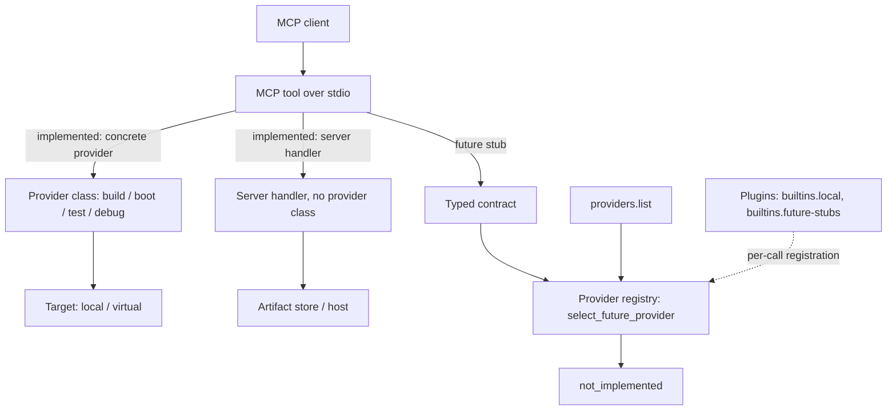

# README Architecture Splash Implementation Plan

> **For agentic workers:** REQUIRED SUB-SKILL: Use superpowers:subagent-driven-development (recommended) or superpowers:executing-plans to implement this plan task-by-task. Steps use checkbox (`- [ ]`) syntax for tracking.

**Goal:** Rework `README.md` into an architecture-first splash that teaches the layered model, the two implemented dispatch paths, the future-provider stubs, and per-architecture maturity — all traceable to code.

**Architecture:** A single-file documentation change. The new README leads with an `## Architecture` section (prose + a Mermaid diagram showing concrete-provider dispatch, server-handler orchestration, the future-stub registry path, and per-call plugin registration), followed by a `## Providers` section with two state-grouped tables, an orchestration-tools list, and an architecture-support note. Existing Quick Start / Connect A Client / Local Workflow / Development sections are kept; "What Works Today" is trimmed.

**Tech Stack:** Markdown, GitHub-flavored Mermaid. No code, no new files. Verification is accuracy cross-checks against the source tree plus link/render/lint gates.

**Spec:** `docs/superpowers/specs/2026-05-26-readme-architecture-splash-design.md` (adversarial-review approved).

---

## Scope

Single subsystem (one file: `README.md`). One plan is appropriate. Per the spec's non-goals: **no code changes and no new files** — that explicitly rules out adding a README-consistency test in this plan (note it as a possible follow-up, do not implement it here).

## File Structure

- Modify: `README.md` — full rewrite of content; the only file touched.
- Read-only references used for accuracy checks (not modified):
  - `src/linux_debug_mcp/providers/plugins.py`, `base.py`, `stubs.py`, `registry.py`
  - `src/linux_debug_mcp/providers/local_kernel_build.py`, `libvirt_qemu.py`, `local_ssh_tests.py`, `qemu_gdbstub.py`
  - `src/linux_debug_mcp/config.py` (`SPRINT_4_DEBUG_OPERATIONS`), `src/linux_debug_mcp/server.py`
  - `docs/ppc64le-provider-spike.md` (link target)

---

## Task 1: Write the new README.md

**Files:**
- Modify: `README.md` (replace entire contents)

- [ ] **Step 1: Confirm the current README and branch**

Run: `git branch --show-current && wc -l README.md`
Expected: branch `docs/readme-architecture-splash`; README is the 46-line current version.

- [ ] **Step 2: Replace `README.md` with the exact content below**

Write this complete file (verbatim — every provider, operation, state, architecture, and target value is already cross-checked against the code):

````markdown
# Linux Development MCP Server

Linux Debug MCP is a Python MCP server for local Linux kernel build, boot,
smoke-test, artifact, and QEMU gdbstub debug workflows. It also ships
discovery-only stubs for future remote, reservation, provisioning, hardware,
console, and real-boot providers.

## Architecture

The server exposes atomic **MCP tools** over stdio. How a tool runs depends on
the tool:

- **Implemented local tools** dispatch in one of two ways, neither of which
  consults the provider registry:
  - *concrete-provider dispatch* — the tool's handler calls a provider class
    directly (`LocalKernelBuildProvider`, `LibvirtQemuProvider`,
    `LocalSshTestProvider`, `QemuGdbstubProvider`) to act on a local or virtual
    target.
  - *server-handler orchestration* — other tools run entirely in the server with
    no provider class. These split into two kinds: tools advertised as
    metadata-only operations of a provider capability (`host.check_prerequisites`
    under `local-prereqs`; `kernel.create_run` and `artifacts.get_manifest` under
    `local-artifacts`), and orphan server tools that back no provider operation at
    all (`providers.list`, `artifacts.collect`, `workflow.build_boot_test`).
- **Future-stub tools** validate a typed request contract, then resolve an
  advertised provider through the registry (`select_future_provider`). A
  contract-valid request that resolves to exactly one provider returns
  `not_implemented`; contract or provider-selection failures — unknown provider,
  an unadvertised operation or architecture, zero matches, or multiple matches —
  return `configuration_error`. These stubs never touch the network, hardware,
  or any external resource.

The **provider registry** is a discovery catalog, not a request hop for
implemented tools. It is materialized on demand from **provider plugins**
(`builtins.local`, `builtins.future-stubs`) whenever `providers.list` or a
future-stub tool needs it — there is no persistent registry built at startup.
The registry, the typed contracts, and registry-mediated selection are the
forward-looking machinery for the future provider surface; today they back
discovery and the stub tools while implemented tools dispatch directly. This is
the current proof-of-concept to functioning-design boundary.



## Providers

Each provider belongs to a *family* and declares an implementation state.
Discovery-only stubs are advertised for planning and contract validation; they
are not working features.

**Implemented** (all x86_64):

| Family | Provider | State | Arch | Representative operations | Target |
|--------|----------|-------|------|---------------------------|--------|
| host | local-prereqs | implemented | x86_64 | host.check_prerequisites | local / virtual |
| artifacts | local-artifacts | implemented | x86_64 | kernel.create_run, artifacts.get_manifest | local / virtual |
| build | local-kernel-build | implemented | x86_64 | kernel.build | local |
| boot | local-libvirt-qemu | implemented | x86_64 | target.boot | virtual |
| test | local-ssh-tests | implemented | x86_64 | target.run_tests | virtual |
| debug | local-qemu-gdbstub | implemented | x86_64 | workflow.build_boot_debug + 11 debug.* ops | virtual |

**Discovery-only stubs (not yet implemented):**

| Family | Provider | State | Arch | Representative operations | Target |
|--------|----------|-------|------|---------------------------|--------|
| build | remote-build-stub | stub | x86_64, ppc64le | remote.build_kernel | remote |
| artifacts | remote-artifact-sync-stub | stub | x86_64, ppc64le | remote.sync_artifacts | remote |
| reservation | reservation-stub | stub | x86_64, ppc64le | reservation.request_host, reservation.release_host | remote / physical |
| provisioning | provisioning-stub | stub | x86_64, ppc64le | provision.prepare_target | remote / physical |
| hardware | hardware-control-stub | stub | x86_64, ppc64le | hardware.power_control | physical |
| console | console-access-stub | stub | x86_64, ppc64le | console.open_session, console.read, console.write | remote / physical |
| boot | real-boot-stub | stub | x86_64, ppc64le | hardware.boot_kernel, workflow.reserve_provision_boot | remote / physical |

A stub request returns `not_implemented` only when it is contract-valid and
resolves to exactly one advertised provider; validation and provider-selection
failures return `configuration_error`. Stubs perform no external side effects.
A third state, `external_reserved`, exists for future externally-hosted
providers but is unused today.

**Orchestration / utility tools** — `providers.list`, `artifacts.collect`, and
`workflow.build_boot_test` — are implemented MCP tools the server registers
directly; they back no provider operation and appear in no provider's metadata.
By contrast, `host.check_prerequisites`, `kernel.create_run`, and
`artifacts.get_manifest` are also server-handled with no provider class, but they
*are* advertised as metadata-only operations of the `local-prereqs` and
`local-artifacts` providers — so they appear in the Implemented table above, while
the three orchestration tools belong to no provider row.

### Architecture support

x86_64 is the only architecture with working implemented providers. `ppc64le` is
recognized by the contract layer and advertised by the future-provider stubs,
but has no functioning implementation yet — see the
[ppc64le Provider Spike](docs/ppc64le-provider-spike.md) for design notes and
current boundaries.

## What Works Today

Local x86_64 build to boot to smoke-test to debug, end to end, plus artifact
manifests and discovery-only future-provider stubs. A full architecture document
is in progress; the sections above are the current orientation.

## Quick Start

```bash
git clone git@github.com:randomparity/linux-debug-mcp.git linux-debug-mcp
cd linux-debug-mcp
just setup
uv run python -m pytest
```

See [Installation](docs/installation.md) for direct `uv`, minimal `pip`, host
check, and server smoke-check commands.

## Connect A Client

The server runs over stdio. See [Client Setup](docs/client-setup.md) for Claude
Code and Codex configuration.

## Local Workflow

Use `providers.list` and `host.check_prerequisites` before selecting a workflow.
The implemented end-to-end local examples are documented in
[Tool Reference](docs/tool-reference.md). Host preparation for libvirt/QEMU is
documented in [Fedora Libvirt User Guide](docs/fedora-libvirt-user-guide.md).

## Development

```bash
just test
just lint
```
````

- [ ] **Step 3: Confirm the file was written**

Run: `rg -c "^## " README.md`
Expected: `7` — the seven `##` headings (Architecture, Providers, What Works Today, Quick Start, Connect A Client, Local Workflow, Development). `### Architecture support` is a `###` heading and is not counted by this pattern.

---

## Task 2: Cross-check every Providers claim against the code

Each command prints the source of truth; compare it to the README table. No edits unless a mismatch is found.

- [ ] **Step 1: Verify implemented provider families, names, operations, target_kinds, architectures**

Run:
```bash
rg -n "provider_name=|provider_family=|operations=|architectures=|target_kinds=" \
  src/linux_debug_mcp/providers/local_kernel_build.py \
  src/linux_debug_mcp/providers/libvirt_qemu.py \
  src/linux_debug_mcp/providers/local_ssh_tests.py \
  src/linux_debug_mcp/providers/qemu_gdbstub.py \
  src/linux_debug_mcp/providers/base.py \
  src/linux_debug_mcp/providers/plugins.py
```
Expected (must match the **Implemented** table):
- local-kernel-build → family `build`, `kernel.build`, `["x86_64"]`, `[LOCAL]`
- local-libvirt-qemu → family `boot`, `target.boot`, `["x86_64"]`, `[VIRTUAL]`
- local-ssh-tests → family `test`, `target.run_tests`, `["x86_64"]`, `[VIRTUAL]`
- local-qemu-gdbstub → family `debug`, `QEMU_GDBSTUB_OPERATIONS`, `["x86_64"]`, `[VIRTUAL]`
- base `sprint0_capability` → `["x86_64"]`, `[LOCAL, VIRTUAL]` (used by local-prereqs and local-artifacts)
- plugins.py → local-prereqs family `host` (`host.check_prerequisites`), local-artifacts family `artifacts` (`kernel.create_run`, `artifacts.get_manifest`)

- [ ] **Step 2: Verify the debug operation count is 12 (build_boot_debug + 11 debug.*)**

Run:
```bash
rg -n "QEMU_GDBSTUB_OPERATIONS" src/linux_debug_mcp/providers/qemu_gdbstub.py
rg -n "SPRINT_4_DEBUG_OPERATIONS" -A12 src/linux_debug_mcp/config.py | rg -c "debug\."
```
Expected: `QEMU_GDBSTUB_OPERATIONS = ["workflow.build_boot_debug", *SPRINT_4_DEBUG_OPERATIONS]`; the second command prints `11`. README says "workflow.build_boot_debug + 11 debug.* ops" — matches.

- [ ] **Step 3: Verify stub providers (families, ops, architectures, target_kinds)**

A text grep over `stubs.py` is not reliable here: the destructive stubs put each
operation string on the line *after* `_operation(`, so a `_operation("` pattern
silently skips `reservation.*`, `provision.*`, `hardware.*`, and
`workflow.reserve_provision_boot`. Assert the full table against the live registry
instead:
```bash
uv run python - <<'PY'
from linux_debug_mcp.providers.registry import ProviderRegistry

caps = {c.provider_name: c for c in ProviderRegistry.with_defaults().list_capabilities()}

expected = {
    "remote-build-stub": ("build", ["remote.build_kernel"], ["remote"]),
    "remote-artifact-sync-stub": ("artifacts", ["remote.sync_artifacts"], ["remote"]),
    "reservation-stub": ("reservation", ["reservation.request_host", "reservation.release_host"], ["remote", "physical"]),
    "provisioning-stub": ("provisioning", ["provision.prepare_target"], ["remote", "physical"]),
    "hardware-control-stub": ("hardware", ["hardware.power_control"], ["physical"]),
    "console-access-stub": ("console", ["console.open_session", "console.read", "console.write"], ["remote", "physical"]),
    "real-boot-stub": ("boot", ["hardware.boot_kernel", "workflow.reserve_provision_boot"], ["remote", "physical"]),
}

stub_names = {n for n, c in caps.items() if c.implementation_state.value == "stub"}
assert stub_names == set(expected), f"stub set mismatch: {stub_names ^ set(expected)}"

for name, (family, ops, targets) in expected.items():
    c = caps[name]
    assert c.provider_family == family, f"{name} family {c.provider_family!r} != {family!r}"
    assert c.implementation_state.value == "stub", f"{name} state {c.implementation_state.value!r}"
    assert c.architectures == ["x86_64", "ppc64le"], f"{name} archs {c.architectures}"
    assert [t.value for t in c.target_kinds] == targets, f"{name} targets {[t.value for t in c.target_kinds]} != {targets}"
    assert c.operations == ops, f"{name} ops {c.operations} != {ops}"

print("all 7 stub providers match the Discovery-only stubs table")
PY
```
Expected: the script prints `all 7 stub providers match the Discovery-only stubs
table`. Any drift between the code and the README's **Discovery-only stubs** table
— a renamed provider, changed family, added/removed/reordered operation, different
architecture set, or different target_kinds — raises an `AssertionError` naming the
offending provider. The expected `operations` lists above are the full operation
set for each stub (the README's "Representative operations" column lists them all),
and every stub uses `architectures == ["x86_64", "ppc64le"]`.

- [ ] **Step 4: Verify implementation states and the orphan orchestration tools**

Run:
```bash
rg -n "class ImplementationState" -A4 src/linux_debug_mcp/domain.py
rg -n "ProviderRegistry.with_defaults\(\)" src/linux_debug_mcp/server.py
rg -n '@app\.tool\(name="(providers\.list|artifacts\.collect|workflow\.build_boot_test)"\)' \
  src/linux_debug_mcp/server.py
uv run python - <<'PY'
from linux_debug_mcp.providers.registry import ProviderRegistry

caps = {cap.provider_name: set(cap.operations) for cap in ProviderRegistry.with_defaults().list_capabilities()}
all_ops = {op for ops in caps.values() for op in ops}

orphans = {"providers.list", "artifacts.collect", "workflow.build_boot_test"}
assert orphans.isdisjoint(all_ops), f"orphan tool wrongly listed as provider operation: {orphans & all_ops}"

metadata_only = {
    "local-prereqs": {"host.check_prerequisites"},
    "local-artifacts": {"kernel.create_run", "artifacts.get_manifest"},
}
for name, expected in metadata_only.items():
    missing = expected - caps.get(name, set())
    assert not missing, f"{name} missing metadata-only ops: {missing}"

print("orphans ABSENT from provider operations:", sorted(orphans))
print("metadata-only ops PRESENT under local-prereqs / local-artifacts")
PY
```
Expected:
- States are `implemented`, `stub`, `external_reserved`.
- `with_defaults()` appears only at the two call sites inside `list_providers_handler` and `_future_stub_handler` (per-call, not at startup).
- The third command prints exactly three lines — `@app.tool(name="providers.list")`, `@app.tool(name="artifacts.collect")`, `@app.tool(name="workflow.build_boot_test")` — proving the server registers all three orchestration tools directly, not through a provider.
- The fourth command prints both lines — `orphans ABSENT from provider operations: ['artifacts.collect', 'providers.list', 'workflow.build_boot_test']` and `metadata-only ops PRESENT under local-prereqs / local-artifacts`. Enumerated from the live `ProviderRegistry.with_defaults()`, this proves both halves of the README's orchestration claim: the three orchestration tools are no provider's operation (so they belong in the orchestration-tools list, not a provider row), while the three metadata-only operations *are* advertised by the `local-prereqs` / `local-artifacts` providers (so they correctly appear in the Implemented table).

- [ ] **Step 5: If any mismatch was found, fix the README table cell to match the code, then re-run the relevant check.** Otherwise proceed.

---

## Task 3: Validate links, Mermaid, and doc-hygiene gates

- [ ] **Step 1: Verify every internal doc link resolves**

Run:
```bash
for f in docs/ppc64le-provider-spike.md docs/installation.md docs/client-setup.md docs/tool-reference.md docs/fedora-libvirt-user-guide.md; do
  test -f "$f" && echo "OK $f" || echo "MISSING $f"
done
```
Expected: five `OK` lines, no `MISSING`.

- [ ] **Step 2: Confirm the README contains no "sprint" terminology**

Run: `rg -n "sprin[t]|Sprin[t]|SPRIN[T]" README.md || echo "CLEAN"`
Expected: `CLEAN`. The scan is a deliberately broad substring match (it also flags
`sprints`, `SPRINT_4`, etc.). Run against the verbatim README payload in Task 1 it
returns `CLEAN` — no word in that payload contains the `sprint` substring (in
particular `progress` does not).

Note on the repo-wide gate: the `check-docs` justfile target runs the same scan
over `README.md` **and** all of `docs/`, and is already red on `main` from a
pre-existing match in
`docs/superpowers/plans/2026-05-25-dynamic-profile-overrides-phase-2.md`. The only
sprint tokens this branch adds live in its own planning artifacts — this plan and
its design spec under `docs/superpowers/` — which legitimately reference the code
constant `SPRINT_4_DEBUG_OPERATIONS` and quote this very regex; they are not
product-doc terminology. This plan therefore scopes its hygiene gate to
`README.md`, the only product doc it changes. Repairing or excluding
`docs/superpowers/` planning artifacts from `check-docs` is a separate, pre-existing
repo concern and is out of scope here.

- [ ] **Step 3: Confirm the Mermaid block is well-formed**

Run: `rg -n '```mermaid' README.md && rg -n "^flowchart TD" README.md`
Expected: one ```` ```mermaid ```` fence and one `flowchart TD` line. Then open the README on the GitHub branch (or paste the block into <https://mermaid.live>) and confirm it renders three labeled arrows *out of* `MCP tool` — concrete provider, server handler, future stub — plus the inbound `MCP client --> MCP tool` edge, the separate `providers.list --> registry` edge, and the dashed `Plugins -.-> registry` registration edge. Mermaid node labels here avoid `(`, `)`, and `<br/>` to stay GitHub-safe — do not reintroduce them.

- [ ] **Step 4: Confirm section structure**

Run: `rg -n "^#{1,3} " README.md`
Expected, in order: `# Linux Development MCP Server`, `## Architecture`, `## Providers`, `### Architecture support`, `## What Works Today`, `## Quick Start`, `## Connect A Client`, `## Local Workflow`, `## Development`.

- [ ] **Step 5: Run the markdown/whitespace pre-commit hooks**

Run: `uv run pre-commit run end-of-file-fixer trailing-whitespace --files README.md`
Expected: both hooks `Passed` (or they auto-fix; if auto-fixed, re-stage README).

---

## Task 4: Commit

- [ ] **Step 1: Stage and review the diff**

Run: `git add README.md && git diff --cached --stat`
Expected: `README.md` is the only changed file.

- [ ] **Step 2: Commit**

```bash
git commit -m "docs: rework README into architecture-first splash

Add Architecture and Providers sections per the approved spec: a Mermaid
diagram of the two implemented dispatch paths plus the future-stub registry
path, state-grouped provider tables with an Arch column, an orchestration-tools
list, and a per-architecture support note. Trim What Works Today.

Co-Authored-By: Claude Opus 4.7 <noreply@anthropic.com>"
```

- [ ] **Step 3: Confirm clean tree**

Run: `git status --short`
Expected: empty.

---

## Self-Review

**Spec coverage:**
- Architecture-first rework, fold "What Works Today" → Task 1 (new structure).
- Mermaid diagram with both dispatch paths + orchestration branch + per-call registration edge → Task 1 diagram; validated in Task 3 Step 3.
- "providers" terminology, no "backend" vocabulary → Task 1 content; sprint-free verified in Task 3 Step 2.
- State column + two state-grouped tables → Task 1 Providers tables.
- Arch column + Architecture support note (x86_64 working, ppc64le contract-only, spike link) → Task 1; link checked in Task 3 Step 1.
- Stub `not_implemented` only when contract-valid and uniquely resolved; else `configuration_error` → Task 1 Architecture + Providers note.
- Registry materialized per call, not at startup → Task 1 Architecture prose; verified Task 2 Step 4.
- Orphan orchestration tools surfaced, not attributed to a provider → Task 1 orchestration list; verified Task 2 Step 4.
- Accuracy traceable to code → Task 2 (all five checks).
- No new files, no code changes → only `README.md` modified (Task 4 Step 1 asserts this); README-consistency test explicitly deferred per spec non-goals.

**Placeholder scan:** No TBD/TODO; full README content is inline; every check has an exact command and expected output.

**Consistency:** Provider names, families, operations, states, architectures, and target_kinds in the Task 1 tables match the Task 2 verification expectations and the spec's verified-facts list.
